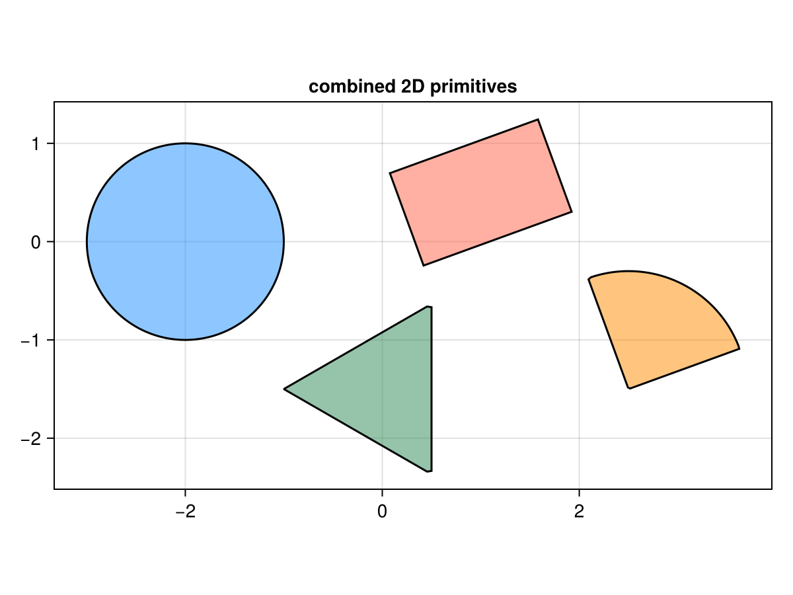
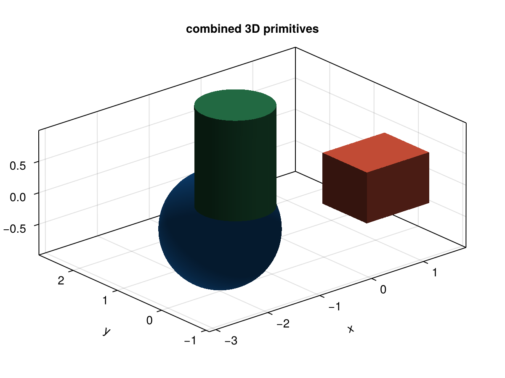

# GeometryPrimitives

[](https://github.com/stevengj/GeometryPrimitives.jl/actions)
[](http://codecov.io/github/stevengj/GeometryPrimitives.jl?branch=master)

This package provides a set of geometric primitive types (balls, cuboids, cylinders, and
so on) and operations on them designed to enable piecewise definition of functions,
especially for finite-difference and finite-element simulations, in the Julia language.

For example, suppose that you are discretizing a PDE like the Poisson equation ∇⋅c∇u = f,
and you want to provide a simple user interface for the user to specify the function `c(x)`.
In many applications, `c` will be piecewise constant, and you want to be able to specify
`c = 1` in one box, `c = 2` in some cylinders, etcetera.   The GeometryPrimitives package
allows the user to provide a list of shapes with associated data (in this case, the value of
`c`) to define such a `c(x)`.

Furthermore, the application to discretized simulations imposes a couple of additional
requirements:

* One needs to be able to evaluate `c(x)` a huge number of times (once for every point on a
grid).  So, we provide a fast O(log n) K-D tree data structure for rapid searching of shapes.

* Often, one wants to compute the *average* of `c(x)` over a voxel, so we provide routines
for rapid *approximate* voxel averages.

* Often, one needs not only the value `c(x)` but the normal vector to the nearest shape, so
we provide normal-vector computation.

This package was inspired by the geometry utilities in Steven G. Johnson's [Libctl]
(http://ab-initio.mit.edu/wiki/index.php/Libctl) package.

## Automatic differentiation

The shape types are immutable and parametrized on their numeric element type, and the
differentiable parts of the API contain no hidden `Float64` conversions, so the package
composes with Julia automatic-differentiation tools.  The differentiable surface is:

* `level(x, shape)` — w.r.t. the query point `x` and the shape parameters,
* `surfpt_nearby(x, shape)` (and `normal`) — w.r.t. `x` and the shape parameters,
* `volfrac(vxl, nout, r₀)` — w.r.t. the voxel corners and the cutting-plane parameters,

where "w.r.t. shape parameters" means differentiating through the shape constructors
(`Ball`, `Cuboid`, `Ellipsoid`, `Polygon`, `Sector`, `Cylinder`, `PolygonalPrism`,
`SectoralPrism`, …).

Gradients are tested against finite differences with:

* [Enzyme.jl](https://github.com/EnzymeAD/Enzyme.jl) (forward and reverse mode),
* [Mooncake.jl](https://github.com/chalk-lab/Mooncake.jl) (reverse mode),

both used directly or through
[DifferentiationInterface.jl](https://github.com/JuliaDiff/DifferentiationInterface.jl)
(see `test/grads.jl`), and with
[Reactant.jl](https://github.com/EnzymeAD/Reactant.jl) for XLA-compiled gradients of the
branch-free `level` functions (see `test/reactant.jl`; run with `GP_TEST_REACTANT=true`).

These AD backends have a high first-call compilation latency for this
`StaticArrays`-heavy code, so the gradient tests are split into four groups —
`x2d`, `x3d`, `param2d`, `param3d` (query-point vs. shape-parameter gradients, in 2D
and 3D) — selectable through the `GP_GRAD_GROUPS` environment variable so that each can be
run in its own process to keep memory bounded:

```sh
GP_GRAD_GROUPS=x2d     julia --project=test test/grads.jl
GP_GRAD_GROUPS=param3d julia --project=test test/grads.jl
```

The default package test suite (`julia --project -e 'using Pkg; Pkg.test()'`) runs the
`x2d` group as a quick smoke test; set `GP_GRAD_GROUPS=all` (or `GP_TEST_AD_FULL=true`) to
exercise all four groups, or `GP_TEST_AD=false` to skip them entirely.  In CI the four
groups run as a separate parallel job, one process per group, so the core test job sets
`GP_TEST_AD=false`.  The backend set can be narrowed with `GP_GRAD_BACKENDS` (a subset of
`enzyme_reverse,enzyme_forward,mooncake`).  Benchmarks of primal vs. gradient evaluation
across the backends live in `benchmark/benchmarks.jl`.

### Performance notes

All three reverse/forward backends produce gradients that match finite differences for
every shape and every differentiable function; the cost is almost entirely *first-call
compilation*, after which a prepared gradient runs in microseconds (see
`benchmark/benchmarks.jl`).  Two points worth knowing:

* Differentiating *through* the `Polygon` constructor (which sorts the vertices and checks
  convexity) is by far the most expensive case to compile, and the cost grows with the
  vertex count — with Enzyme reverse mode a single 5-vertex polygon-parameter gradient
  takes a few minutes to compile (Enzyme forward ≈ 10 s, Mooncake ≈ 40 s for the same
  case).  Differentiating w.r.t. the query point `x` (with the polygon built outside the
  differentiated function) is cheap.  The `param2d`/`param3d` test groups therefore use a
  single small polygon as the representative polygon-construction case.
* For the simple shapes (`Ball`, `Cuboid`, `Ellipsoid`, `Sector` and the non-polygonal
  prisms) every backend compiles in well under a minute.

Once compiled, a single gradient evaluation costs from a few nanoseconds (e.g. `level`) to
a few microseconds (e.g. `volfrac`), typically a small multiple of the primal evaluation,
and one to three orders of magnitude faster than the finite-difference gradient.  See
[`benchmark/results.md`](benchmark/results.md) for a representative table.

Note that `surfpt_nearby` and `volfrac` select branches (nearest face, voxel/plane
crossing cases, …) based on the input values; their outputs are continuous and piecewise
differentiable, and AD returns the gradient of the active branch.

## Plotting

Loading [Makie](https://docs.makie.org) together with this package activates a package
extension that provides `drawshape` / `drawshape!` for every shape type:

* **2D shapes** (`Ball`, `Cuboid`, `Ellipsoid`, `Polygon`, `Sector`, and 2D
  `CrossSection`s of 3D shapes) are drawn as a filled boundary polygon in an `Axis`.
* **3D shapes** (`Ball`, `Cuboid`, `Ellipsoid`, `Cylinder`, `PolygonalPrism`,
  `SectoralPrism`) are drawn as a shaded surface mesh in an `Axis3`.

```julia
using GeometryPrimitives, CairoMakie    # or GLMakie

drawshape(Sector([0,0], 1.3, deg2rad(20), deg2rad(110)); color=:dodgerblue)  # 2D, new Figure
drawshape(Cylinder([0,0,0], 0.8, 1.8, [0.25,0.1,1.0]); color=:seagreen)       # 3D, new Figure

# add to an existing axis, and take an axis-aligned 2D slice of a 3D shape:
fig = Figure(); ax = Axis(fig[1,1]; aspect=DataAspect())
s = Cuboid([0,0,0], [1.6,1.1,0.8])
drawshape!(ax, s(:z, 0.0))        # the z = 0 cross section (a CrossSection, i.e. a Shape2)
```

`drawshape!(ax, s)` adds shape `s` to the given axis (an `Axis` for 2D, an `Axis3` for 3D),
so several primitives can be combined in one scene.  Rendering needs no external meshing
package: each primitive is convex, so its boundary is found by bisecting the level-set
function along rays from an interior point, and the resulting meshes render with the
pure-CPU [CairoMakie](https://docs.makie.org/stable/explanations/backends/cairomakie)
backend (handy for headless PNG output).  3D meshes are shaded manually (CairoMakie applies
no real lighting): flat per-face shading for the polyhedral/extruded shapes and smooth
radial shading for `Ball`/`Ellipsoid`.

| 2D primitives | 3D primitives |
|---|---|
|  |  |

`test/visualize.jl` is an optional test that renders an example of every primitive — a 2D
plot for each 2D shape, and a 3D perspective view plus axis-aligned 2D slices for each 3D
shape — saving each as a PNG (under `GP_VIZ_DIR`, default `test/viz_output`).  Run it with
the bundled `viz` environment:

```sh
julia --project=viz test/visualize.jl
```

(or inside the package test suite with `GP_TEST_VIZ=true`, if CairoMakie is available in the
active environment).
